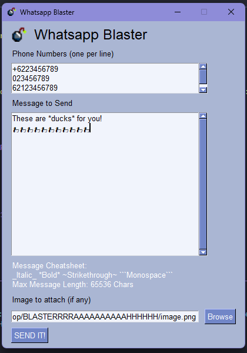

# Simple Whatsapp Blaster
Implementation of [WPP_Whatsapp](https://github.com/3mora2/WPP_Whatsapp) over [PySG](https://github.com/PySimpleGUI/PySimpleGUI)

## Disclaimer
This tool is intended to be used for small testing only (not spamming or harming any user), violating Whatsapp's Term of Service and/or End User License Agreement would lead to **termination of an account**. Use it at your own risk, always abide the platform's ToS, EULA, and Rules. You have been warned.
## Get Started
### Prerequisites
- Python =>3.10 (Tested on Python 3.10 for Windows)
- Python PIP (Installed via get-pip)
- Virtual Environment (Optional)

then follow this next step
```powershell
git clone https://github.com/rizaldyaristyo/simple-whatsapp-blaster
cd simple-whatsapp-blaster
pip install -r requirements.txt
playwright install
```
### Running
```powershell
python3 main.py
```
- Fill in the form and send
- A Chromium window will popup asking for QR Code scan (only for the first time / after logout)
- Wait until done